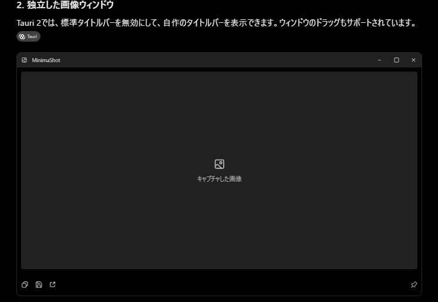

要件

```
全画面キャプチャ
アクティブウィンドウのキャプチャ
独立ウィンドウを出す
編集はpaintなどの外部ツールで
画像かパス（保存時のみ）がをクリップボードにコピーを選べる
保存・保存せず表示するだけを選べる
保存パスフォーマットは日付から自由に設定できる
機能が少ないことを機能にしたい

ctlr+print screenで領域キャプチャ
アクティブウィンドウをキャプチャalt+print screen

独立ウィンドウに、windowsのトップバーはださず、独自の薄い（24pxくらい）タイトルバーを出したい（右端に_□x）
独立ウィンドウ全体ドラッグ可能

操作フロー
１．printscri+alt
２．領域をキャプチャ
３．独立ウィンドウが出る
４．登録した外部ツールで開く、or画像かパスコピペ（ペイントやcliツールなど）保存はされるかされないかはオプションで設定
保存先はデフォルトではピクチャ\<appname>\<YYYY-MM>以下

printscreen単体は上書きしない
画像編集機能を一切作らない
でもタブはほしいかもしれない（実験的に作る。まずはタブ非搭載のMVPを作る。その後でタブ機能を作る。ダメだったらあとから簡単に切り離せるように作る）
独立ウィンドウは、Snipasteのように複数枚を同時に画面上へ浮かせられるけど、タブにもまとめられる
基本的なタブ操作も一式ほしいかも
移動、閉じる（確認つき）、一括閉じる（確認つき）
ホイールでタブ移動、ホイールクリックで閉じる、ドラッグで移動
タブ機能は一切オフにもできて、複数枚を同時に画面上へ浮かせられる仕様に切り替えられるようにもできたらいいかも
あと、すべてのウィンドウをマージ機能は外せない

conventional commitsで、コミット英語
uiは日本語で（ただしテキストは言語ファイルにまとめたい）
名前はMinimalShotとかで

uiはダークモードだけでライトは実装しない
cssはデザイントークンを規程して厳密に守る
画面キャプチャ、ファイル保存、クリップボード、外部プロセス起動をRustに任せ、TypeScriptは設定画面と画像ビューアだけにする

- 言語・フレームワーク：Rust + Tauri 2 + TS + React
- 複雑な操作とアクセシビリティ：Radix Primitives
- 見た目: plain CSS + CSS Custom Properties（デザイントークン）
- アイコン: 既存の **Lucide React**
- 状態管理：Zustand

ビルドツールはvite
playwright、vitestなどでテストする

```

たたき台設定こんな感じ
```
[hotkeys]
region = "Ctrl+PrintScreen"
window = "Alt+PrintScreen"
fullscreen = "Shift+PrintScreen"

[capture]
auto_save = false
auto_copy = "image" # none / image / path

[storage]
directory = "{pictures}/{appname}"
format = "%Y-%m/%Y-%m-%d_%H-%M-%S.png"

[viewer]
always_on_top = false
confirm_on_close = false

[external]
editor = "mspaint.exe"
```



## MOC
- Relateds
- References
    - [ShareX設定整理案 - ChatGPT](https://chatgpt.com/c/6ac84cb1-24d4-83e8-b60e-5d39743e9c79)
    - [ChatGPTの設計レビュー - 共有コンテンツ](https://chatgpt.com/s/t_6ac85d834ce8819182bfbb633f2b97cb)
